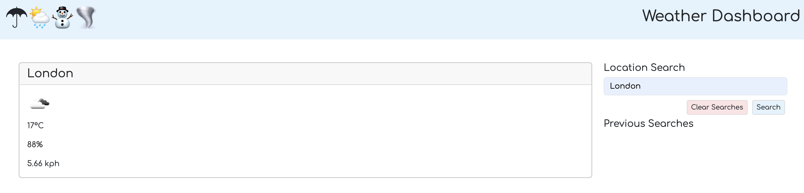

# weather-dashboard

Our application harnesses the power of the OpenWeather API to retrieve up-to-date weather and forecast data for cities across the United States.  Simply enter your preferred city and click "search" to access the latest weather conditions and a five-day forecast. Additionally, we store your previous searches in your local storage for quick and easy access, with search history conveniently available as buttons to facilitate re-examining weather and forecasts.

## Getting Started

Not Available

### Prerequisites

Not Available

### Installing

Not Available

### Code Snippet

Not Available

## Built With

* [HTML](https://developer.mozilla.org/en-US/docs/Web/HTML)
* [CSS](https://developer.mozilla.org/en-US/docs/Web/CSS)
* [JavaScript](https://www.javascript.com/)
* [Bootstrap](https://getbootstrap.com/)
* [jQuery](https://jquery.com/)
* [Day.js](https://day.js.org//)

## Deployed Link

* [See Live Site](https://eviehoang.github.io/weather-dashboard/)

## Authors

* **NHI HOANG** 

- [Link to Portfolio Site](https://eviehoang.github.io/evie-portfolio/)
- [Link to Github](https://github.com/eviehoang)
- [Link to LinkedIn](https://www.linkedin.com/in/ynhihoang/)

See also the list of [contributors](https://github.com/your/project/contributors) who participated in this project.

## License

Not available at this time. 

## Acknowledgments

* Code base provided by Berkeley Bootcamp Team: Original Repository Source: [Github](https://github.com/coding-boot-camp/crispy-octo-meme).
* [W3School](w3schools.com/) for example codes to reference.
* [Bootstrap](https://getbootstrap.com/) for buttons, modal, layout, css resources.
* [jQuery](https://jquery.com/) for scripts.
* [Day.js](https://day.js.org//) for pulling date.
